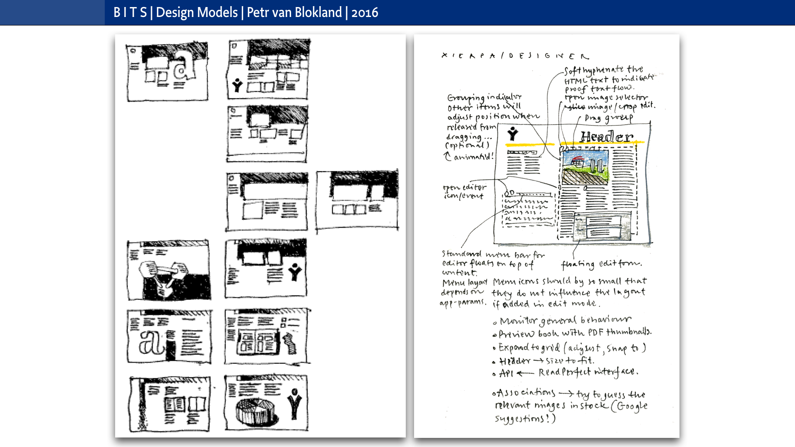
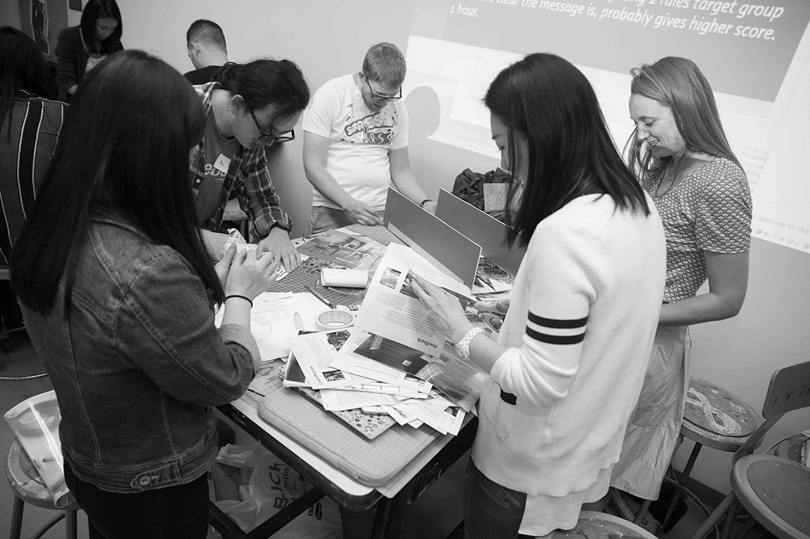

~~~
cid = 'DesignDesign.Space'

doc.lib['footer'] = """Let us know what you think. Do you have any questions for us? <a href="mailto:info@designdesign.space?subject=Tell me more about DesignDesign.Space">info@designdesign.space</a>."""

doc.title = doc.name = 'Design&nbsp;Design&nbsp;Space'
page = doc[1]
box = page.select('Logo')
~~~
# DesignDesign.Space

~~~
box = page.select('HeroIntroduction')
~~~
## What are the *dreams* and *dragons* in your design process? How do you change a plan into a planning and mistakes into treasures? How will your profession change in the next 5 years?

<!-- Where can you find the design space to develop? -->

~~~
box = page.select('HeroSlides').newSlide()
~~~

~~~
box = page.select('HeroSlides').newSlide()
~~~

~~~
box = page.select('HeroSlides').newSlide()
~~~

~~~
box = page.select('HeroSlides').newSlide()
~~~

~~~
box = page.select('Content')
~~~

# What do you want to study?

What makes a design process *fundamentally* different from a production process, is that repetition improves the result. Starting with quick sketches, ignoring most details, next steps take more time. It’s not a linear process, it’s an iterative process, which means repeating the previous step in more detail.

# What would you like to achieve?

Second context box. *DesignDesign.Space* is an online coaching environment to develop your design skills. Query your questions and improve your sketching. Acquire new techniques and research your way of presentating. In short, a space where you can design your design process. 

~~~Python
box = page.select('ColoredSectionHeader')
~~~
# Some examples of studies and workshops

~~~Python
box = page.select('ColoredSection0')
~~~
## Sketching prototypes

*DesignDesign.Space* is an online coaching environment to develop your design skills. Query your questions and improve your sketching. Acquire new techniques and research your way of presentating. In short, a space where you can design your design process. 

## Sketching prototypes

*DesignDesign.Space* is an online coaching environment to develop your design skills. Query your questions and improve your sketching. Acquire new techniques and research your way of presentating. In short, a space where you can design your design process. 

~~~Python
box = page.select('ColoredSection1')
~~~
## Typedesign and coding

By definition designers are bad planners. It seems to be fundamental to design. Too optimistic in the beginning – “There is still plenty of time”, a design is never finished – “The next one will always be better”. 

## Typedesign and coding

By definition designers are bad planners. It seems to be fundamental to design. Too optimistic in the beginning – “There is still plenty of time”, a design is never finished – “The next one will always be better”. 

~~~Python
box = page.select('ColoredSection2')
~~~
## Educating design

The core idea behind designing the design process, is that it doesn’t make a difference for how long you do it. A project of 1 hour, basically goes through the same stages (research – design – presentation) as a project of 1 year. 

## Programming publications

The core idea behind designing the design process, is that it doesn’t make a difference for how long you do it. A project of 1 hour, basically goes through the same stages (research – design – presentation) as a project of 1 year. 

~~~Python
box = page.select('Footer').append(doc.lib['footer'])
~~~
 
~~~Python
# -----------------------------------------------------------
page = page.next
box = page.select('Logo')
~~~

# Design Design Studies

~~~Python
box = page.select('HeroSlides').newSlide()
~~~

~~~Python
box = page.select('HeroSlides').newSlide()
~~~

~~~Python
box = page.select('HeroSlides').newSlide()
~~~

~~~Python
box = page.select('Introduction')
~~~
## Here is another text. What are the dreams and dragons in your design process? How do you change a plan into a planning and mistakes into treasures? Where can you find the design space to develop?

~~~Python
box = page.select('Footer').append(doc.lib['footer'])
~~~

~~~Python
page = page.next
box = page.select('Logo')
~~~

# Design Design Scales

~~~Python
box = page.select('HeroSlides').newSlide()
~~~

~~~Python
box = page.select('HeroSlides').newSlide()
~~~

~~~Python
box = page.select('HeroSlides').newSlide()
~~~

~~~
box = page.select('Introduction')
~~~
## Here is another text. What are the dreams and dragons in your design process? How do you change a plan into a planning and mistakes into treasures? Where can you find the design space to develop?

~~~
box = page.select('Footer').append(doc.lib['footer'])
~~~

~~~
page = page.next
box = page.select('Logo')
~~~

# Design Design Costs

~~~
box = page.select('Content')
~~~

## What does it cost?

* 1 day $150 (<a href="game.html">Design Game</a>, group of minimal 12)
* <a href="projects.html#oneWeek">1 week</a> $900 (7 days, group of 4 or more)
* <a href="projects.html#fourWeeks">1 month</a> $1,900 (calendar month, individual or group)
* <a href="projects.html#oneSeason">1 season</a> $3,900 (3 calendar months, individual or group)
* <a href="projects.html#oneYear">1 year</a> $7,900 (individual or group)

Prices are per person. Discount or split payment for the month, season and year trainings can be discussed, depending on your personal situation.

For corporate trainings, groups or customized requests, please <a href="mailto:info@designdesign.space?subject=Tell me more about DesignDesign.Space">contact us</a>.

Students who whish to extend one training level into another, a 50% reduction is applied on previous payed tuition. E.g 1 day followed by 1 week: 1/2 $150 + $900 = $975. Or 1 week followed by 1 month: 1/2 $900 + $1,900 = $2,350. Or 1 week followed by 1 season: 1/2 $900 + $3,900 = $4,350

## How to reserve and pay?
<a href="mailto:info@designdesign.space?subject=Tell me more about DesignDesign.Space">Contact us to check available spaces for the study of your choice.</a>

### Bank
Paying through direct bank transfer:

Buro Petr van Blokland + Claudia Mens

IBAN NL62RABO0129859338, BIC RABONL2U

Inside EU: Add your VAT number, we will send you an invoice.

Inside The Netherlands: Add 21% BTW, we will send you an invoice.

### Paypal (in case direct bank transfer fails)
Buro Petr van Blokland + Claudia Mens | E-mail: buro@petr.com

#### Add +4% costs:

1 day &#36;150 + &#36;6 = &#36;156 

3 days &#36;450 + &#36;18 = &#36;468 

1 week &#36;900 + &#36;36 = &#36;936 

1 day + 1 week &#36;1.200 + &#36;48 = &#36;1.248 

4 weeks &#36;1.900 + &#36;76 = &#36;1.976 

1 season &#36;3.900 + &#36;156 = &#36;4.056 

1 year &#36;7.900 + &#36;316 = &#36;8.216

~~~
box = page.select('Footer').append(doc.lib['footer'])
~~~

~~~
page = page.next # 5
box = page.select('Logo')
~~~
# Design Design Contact

~~~
box = page.select('Content')
~~~

### Petr van Blokland

Petr van Blokland (1956, Netherlands) graduated cum laude from the graphic arts program at the Royal Academy of Fine Arts (KABK) in The Hague in 1980.

With his partner Claudia Mens, Van Blokland worked for over thirty-five years as a designer in the studio they cofounded. His output ranged from sketching and model-making to programming in various languages. He specialized in systematic design: corporate identities, form systems, online publications, and tools for type design.

Van Blokland has taught graphic design, typography, and type design for many years at the Royal Academy of Fine Arts (KABK) in The Hague and at the Academy of Fine Arts, Arnhem. His first typeface was Proforma, a large series commissioned by Purup, a Danish manufacturer of form-preparation systems. Proforma has now been released for general use through Type Network. In 1988, Van Blokland’s work brought him ATypI’s coveted Charles Peignot Prize.

As cofounder and partner of Type Network, Van Blokland is a dedicated contributor and developer of new type and tools for type design. He currently teaches in the Master’s program in Graphic Design at AKV|St.Joost in Breda and at Type and Media, the Master type design program at KABK in The Hague. Learn more about his thoughts on design and education in his Lubalin lecture at Cooper Union in 2015: <a href="https://vimeo.com/133052206" target="External">Words</a> or the ATypI 2017 lecture about <a href="https://youtu.be/fPasHswCB8E">PageBot</a>

### Claudia Mens

Claudia Mens (1957, Netherlands) graduated from the Interior Design program at the Royal Academy of Fine Arts (KABK) in The Hague in 1985. Then she studied at the Master Environmental Design and graduated in 1989 at the KABK as well. 

With her partner Petr van Blokland, she worked and ran the studio van Blokland + Mens for over twenty five years as designer. 

Before she became a designer, she worked as a school and career counselor for a couple of years. In the recent years she has developed as a trainer coach.

Besides her studio work, she has taught at the KABK for over twenty years at the Graphic Design department.

In 2016 she initiated <a href="http://peppertom.com" target="External">Pepper+Tom</a>, a self initiated project. P+T is “a playing ground” where she presents her series of designed and produced skirts and scarfs. 

Both products are “people’s projects”: working together with a group of professionals under sustainable circumstances, with eco friendly fabrics, under the conditions of “slow fashion”. 

### Crew of others…

Depending on necessary domain knowlegdge, other designers and professionals can be added to the team. Former students, collegue designers, lectureres and relations of the studio are available if that fits the topics at hand.

~~~
box = page.select('Footer').append(doc.lib['footer'])
~~~
